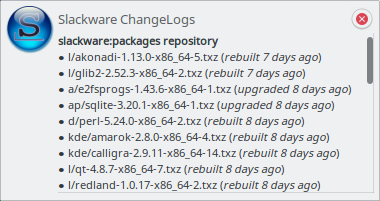
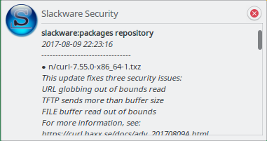
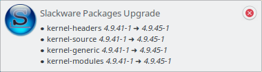
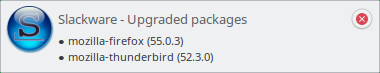

# SlackMan D-Bus interface

## Service

SlackMan expose a system D-Bus service interface called  `org.lotarproject.SlackMan`
provided by `/usr/libexec/slackman/slackman-service` daemon.

## Methods, Signals & Properties

`org.lotarproject.SlackMan` D-Bus interface methods, signals and properties:

Method                                 | Description
---------------------------------------|----------------------------------------
`Changelog( string repo_id )`          | Return last ChangeLog entries from all Slackware Changelog repositories
`SecurityFix(void)`                    | Return last packages whit Security Fix from all Slackware Changelog repositories
`PackageInfo( string package_name )`   | Return a information of installed package
`CheckUpgrade(void)`                   | Return all available upgrades of installed packages
`Notify ( string action, string summary, string body )` | Send notification

Signals                                | Description
---------------------------------------|----------------------------------------
`PackageInstalled`                     | This signal is emitted when a package is installed
`PackageUpgraded`                      | This signal is emitted when a package is upgraded
`PackageRemoved`                       | This signal is emitted when a package is removed

Properties                             | Description
---------------------------------------|----------------------------------------
`version`                              | Return SlackMan version
`slackware`                            | Return Slackware version (eg, **14.2**, **current**)

## SlackMan Notifier

`slackman-notifier(1)` is user-space utility to receive a desktop notification via
D-Bus (using `org.freedesktop.Notification` service) for Slackware Security
Advisories, ChangeLogs and new packages upgrade.

  - Packages with Security Fix
  - Repositories ChangeLog updates
  - Installed packages upgrade
  - Installed, Upgraded and Removed package list from `slackman(8)` command

### SlackMan DBus service and SlackMan Notifier architecture

    +------------------------------+       +--------------+
    |   org.lotarproject.SlackMan  | ----> | D-Bus daemon | <-----------\
    |   ( D-Bus system service )   | <---- | (system bus) | -----------\ \
    +------------------------------+       +--------------+            | |
                  |                                                    | |
                  |                                                    | |
                  v                                                    | |
           +--------------+                                            | |
           |  SlackMan DB |                                            | |
           +--------------+                                            | |
                                                                       v |
    +------------------------------+      +---------------+      +-------------+
    | org.freedesktop.Notification | <--- | D-Bus daemon  | <--- |  SlackMan   |
    |  ( D-Bus session service )   |      | (session bus) |      |   Notifier  |
    +------------------------------+      +---------------+      +-------------+

### Screenshots

**Slackware ChangeLogs**

**Slackware Security**

**Slackware Upgrade**

**Slackware Installed Packages**

**Slackware Upgraded Packages**

**Slackware Removed Packages**

